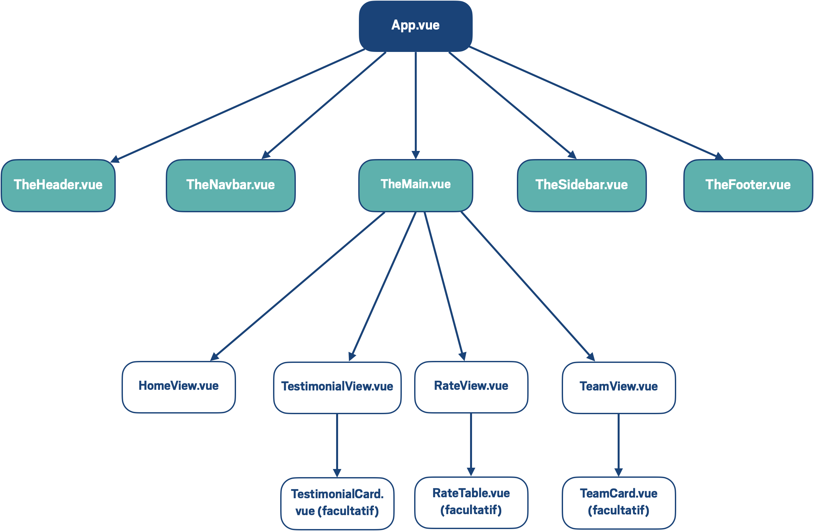

# static-nav-vue

A partir d'un site static contenant des fichiers html et css, le but de ce projet était de le transformer en un projet Vue.js.

Cette branche ajoute des transitions avec le composant `<transition>` de Vue.js et en utilisant la librairie [Animate.css](https://animate.style/).

## Schéma de l'organisation du projet

